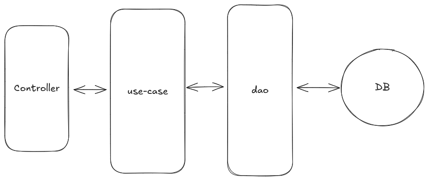

# KYC

This project is a simple backend for a customer submission management system.

## Layer Architecture



- **Controller**: The layer responsible for handling HTTP requests, routing them to the appropriate use cases, and returning the responses to the client.
- **Use Case**: The business logic layer that encapsulates a specific operation or workflow, coordinating data flow between controllers and DAOs.
- **DAO (Data Access Object)**: The layer responsible for interacting directly with the database, providing methods to query, insert, update, or delete data.

## Setup locally

1. Clone the repository:

   ```bash
   git clone git@github.com:MohammadAzhari/KYC.git
   ```

2. Install dependencies:

   ```bash
   npm install
   ```

3. Run unit tests:

   ```bash
   npm run test
   ```

4. Create a `.env` file:
   Create a `.env` file in the backend directory, similar to the `.env.sample` file provided. You'll need to fill in the connection string for MySql.

5. Run the migrations:

   ```bash
   npx prisma migrate deploy && npx prisma generate
   ```

6. Run seed script:

   ```bash
   npx prisma db seed
   ```

7. Run the development server:

   ```bash
   npm run dev
   ```

8. To import the Postman collection, Checkout the `KYC.postman_collection.json` file and import it into Postman.

Enjoy!
